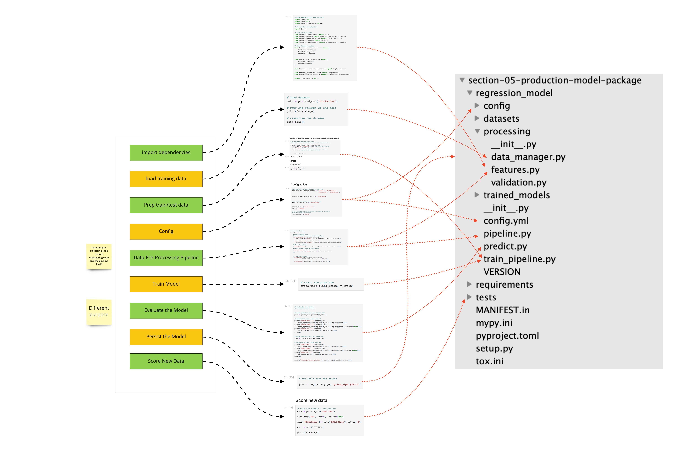
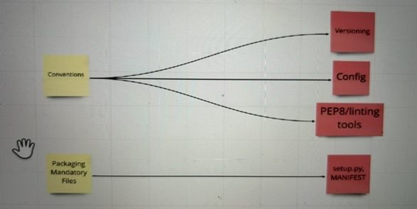
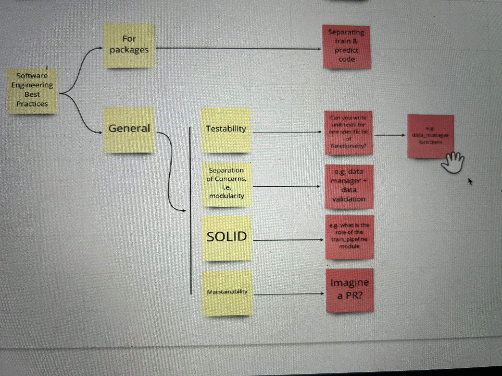

# Packaging Model For Deployment
- Production Code is designed to be deployed to end user.
- In this phase we move from research code to the production code.

### Production Code Considerations
- Testability and Maintainability
- Scalability and Performance
- Reproducubility

<hr>

### Code Mapping


<hr>

### Best Practices




# Poetry
```
poetry add pytest
poetry show
poetry add requests@2.12.1
poetry remove requests

poetry add requests^2.12.1
poetry add requests~2.12.1
poetry install
poetry shell

poetry version minor
```